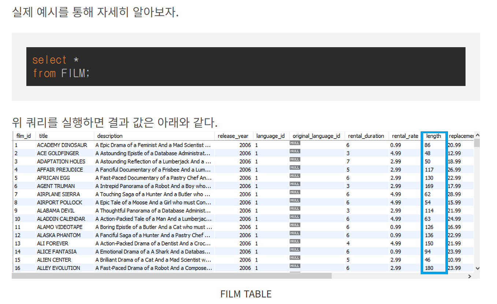
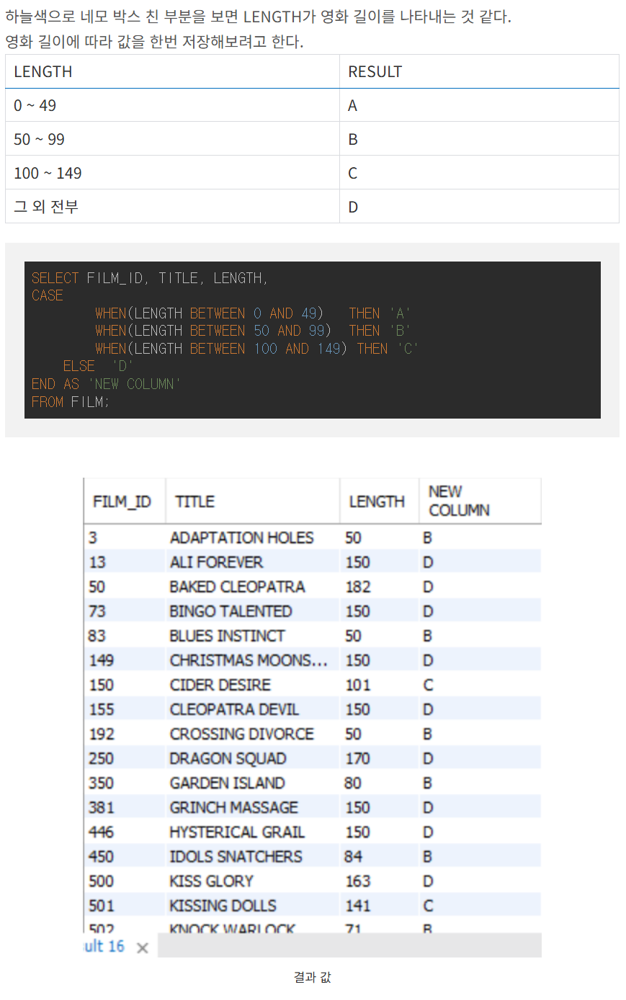
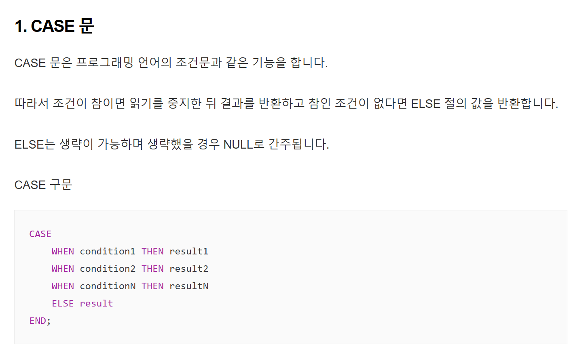

### SQL 에서의 CASE 
    SELECT
    CASE
        WHEN(조건A) THEN A
        WHEN(조건B) THEN B
		ELSE C
    END AS 원하는 컬럼명
    FROM TABLE;

- 조건 A 를 만족할 땐 A라 출력하고, B를 만족하면 B 그 외에는 다 C라고 출력하는 간단한 sql 쿼리이다.
---

---

